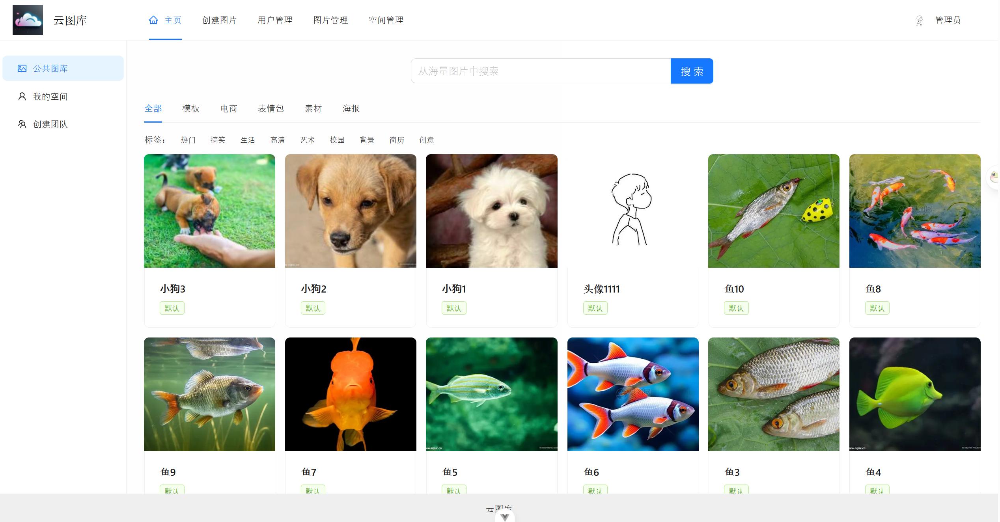
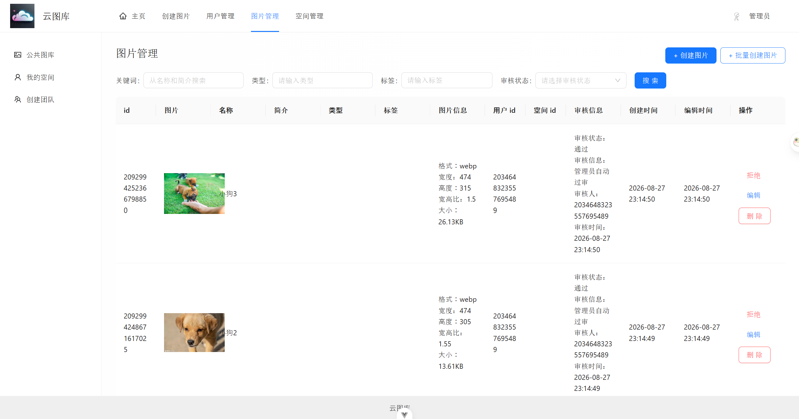
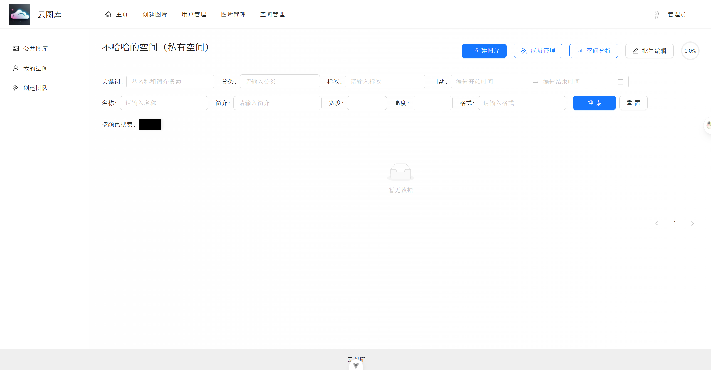

# 智能协同云图库项目介绍

## 项目介绍

基于 Vue 3 + Spring Boot + COS + WebSocket 的 **企业级智能协同云图库平台**。

这个平台核心功能可分为 4 大类，将分为 3 个阶段

1）所有用户都可以在平台公开上传和检索图片素材，快速找到需要的图片。可用作表情包网站、设计素材网站、壁纸网站等：

2）管理员可以上传、审核和管理图片，并对系统内的图片进行分析：

3）对于个人用户，可将图片上传至私有空间进行批量管理、检索、编辑和分析，用作个人网盘、个人相册、作品集等：

4）对于企业，可开通团队空间并邀请成员，共享图片并 **实时协同编辑图片**，提高团队协作效率。可用于提供商业服务，如企业活动相册、企业内部素材库等：

### 项目三大阶段

1）第一阶段，开发公共的图库平台。实战 Vue 3 + Spring Boot 图片素材网站的快速开发，学习文件存管业务的开发和优化技巧。

> 成果：可用作表情包网站、设计素材网站、壁纸网站等

2）第二阶段，对项目 C 端功能进行大量扩展。用户可开通私有空间，并对空间图片进行多维检索、扫码分享、批量管理、快速编辑、用量分析。该阶段涉及大量主流业务功能开发，能学到很多业务知识和开发经验。

> 成果：可用作个人网盘、个人相册、作品集等

3）第三阶段，对项目 B 端功能进行大量扩展。企业可开通团队空间，邀请和管理空间成员，团队内共享图片并实时协同编辑图片。该阶段涉及大量商业项目的应用场景，能学到很多架构设计和项目优化的技巧。

> 成果：可用于提供商业服务，如企业活动相册、企业内部素材库等

项目架构设计图：

